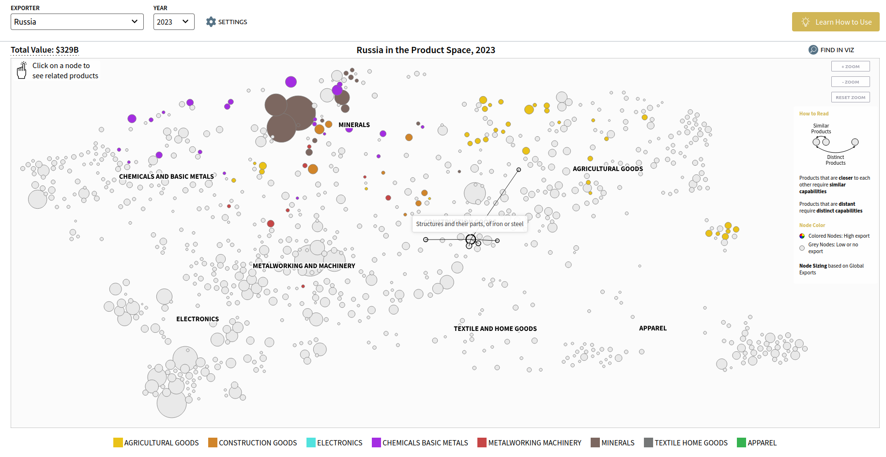

# Product Space Visualization

> ...





## Data Model

```json
{
    "exportValue": 76304.0,
    "rca": 0.03989565,
    "x": 1.2879449187415748,
    "y": 1.262717385851504,
    "product": {
        "id": "product-HS-650",
        "code": "0101",
        "shortName": "Horses",
        "longName": "Live horses, asses, mules or hinnies",
        "topLevelParent": {
            "id": "product-HS-2",
            "shortName": "Agriculture",
            "__typename": "Product"
        },
        "__typename": "Product"
    },
    "connections": [],
    "__typename": "ProductSpaceDatum"
}
```

```json
{
    "productId": "product-HS12-1",
    "productLevel": 1,
    "code": "1",
    "nameEn": "Textiles, garments, footwear and furniture",
    "nameShortEn": "Textiles",
    "showFeasibility": true,
    "parent": null,
    "topParent": {
        "productId": "product-HS12-1",
        "productLevel": 1,
        "__typename": "Product"
    },
    "greenProduct": null,
    "__typename": "Product"
}
```

Note: This data visualization is implemented using SVG graphics.

## Product Connections

Representation:

```json
"topParent": {
    "productId": "product-HS12-1",
    "productLevel": 1,
    "__typename": "Product"
}
```

## References

- [networkx](https://righteous-guardian-68f.notion.site/networkx-4bb100fd0e9747868dbad34e30d03ae5?pvs=4)
- [Canvas Graphics](https://righteous-guardian-68f.notion.site/Canvas-Graphics-200c0f5171ec800c8dc5ecc13d622505?pvs=4)
- [Product Space](https://atlas.hks.harvard.edu/explore/productspace)
- [Dominican Republic in the Product Space, 2023](https://atlas.hks.harvard.edu/countries/214/paths)
- [Scalable Vector Graphic (SVG)](https://righteous-guardian-68f.notion.site/Scalable-Vector-Graphic-SVG-48433c35483249aeb220209f61c1b9b1?pvs=4)
- [Graphology](https://graphology.github.io/)
- [sigma.js](https://www.sigmajs.org/)
- [Cytoscape.js](https://js.cytoscape.org/)
